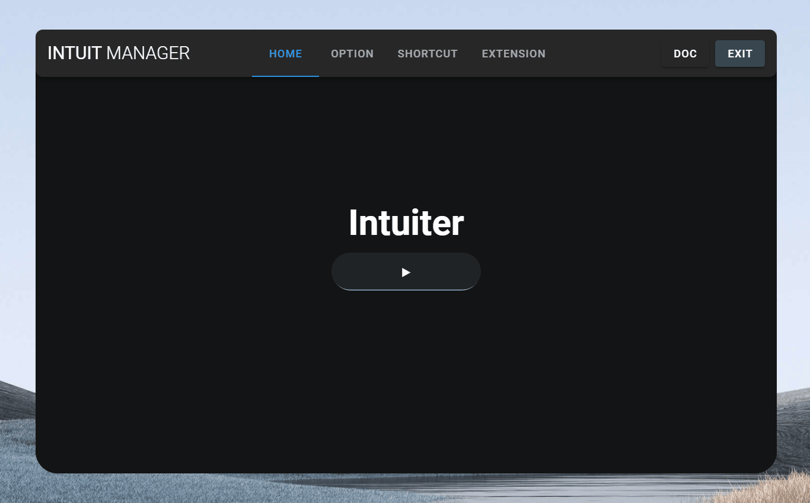

# Dancing Button
### typescript implementation of [liquid button v2](https://codepen.io/Zaku/pen/eRmRxz)

[](https://github.com/seonglae/intuiter)

### Above app is [Intuiter](https://github.com/seonglae/intuiter)

<br/>

# Install
```bash
npm i dancing-button
yarn add dancing-button
pnpm add dancing-button
```

# example
```html
<svg class="dancing-button"/>
```

```typescript
const button: <SVGElement> = document.querySelector('.dancing-button')
const btn = new LiquidButton(button)
```